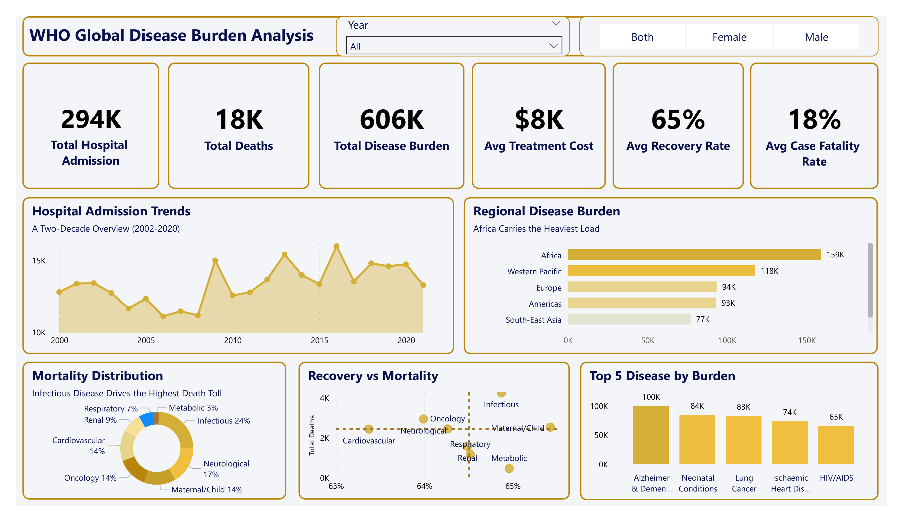
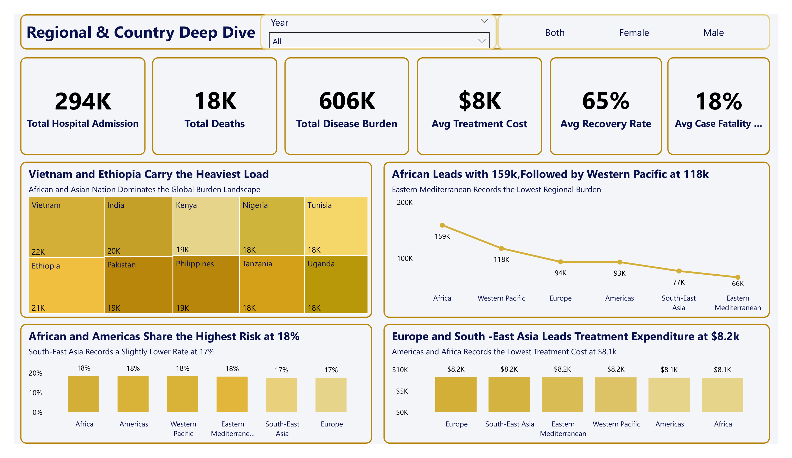
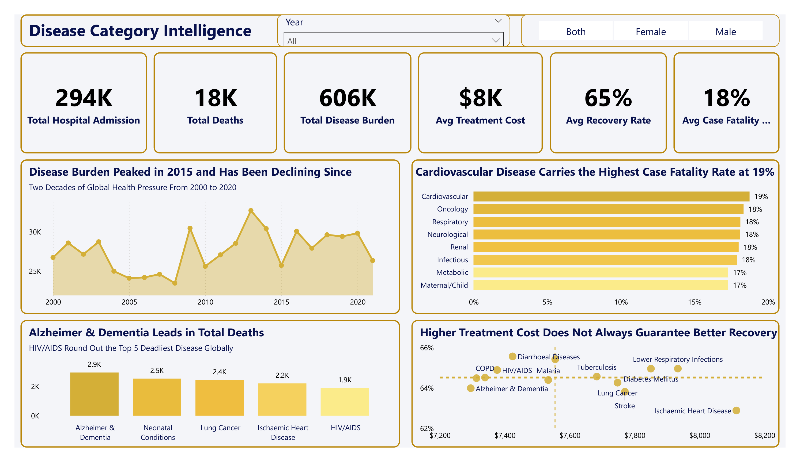
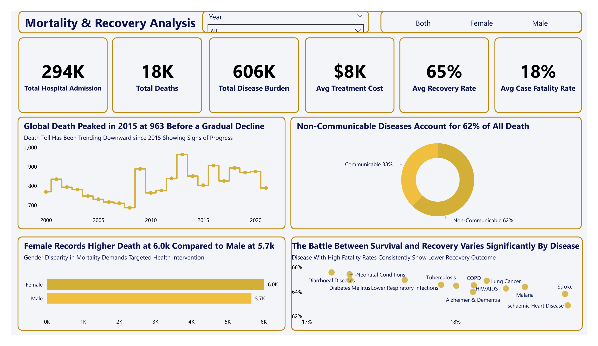

#  WHO Global Disease Burden Analysis



> *"Transforming 20 years of WHO global health data into actionable intelligence 
that can save lives and guide policy decisions."*

---

##  Table of Contents
- [Project Overview](#project-overview)
- [Problem Statement](#problem-statement)
- [Objectives](#objectives)
- [Data Source](#data-source)
- [Data Model](#data-model)
- [Tools & Technologies](#tools--technologies)
- [Data Cleaning & Transformation](#data-cleaning--transformation)
- [DAX Measures](#dax-measures)
- [Dashboard Pages](#dashboard-pages)
- [Key Insights](#key-insights)
- [Strategic Recommendations](#strategic-recommendations)
- [Project Limitations](#project-limitations)
- [Skills Demonstrated](#skills-demonstrated)
- [Links](#links)
- [Author](#author)

---

##  Project Overview
The WHO Global Disease Burden Analysis is a comprehensive 4-page Power BI dashboard that transforms 20 years of WHO global health data (2000–2020) into clear, actionable intelligence. The project covers 45 countries, 13 diseases and 6 WHO regions, providing decision-makers with a full picture of where disease burden falls heaviest, which diseases are deadliest, and how recovery and mortality trends have shifted over two decades.

This project was built end-to-end — from raw data ingestion and SQL cleaning in SQL Server Management Studio (SSMS), through Star Schema data modeling, DAX measure development, and finally a fully interactive Power BI dashboard featuring a gold monochromatic design system.

---

##  Problem Statement
Global health decision-makers, policy analysts and public health organizations face a critical challenge  the inability to clearly visualize and compare disease burden, mortality rates, treatment costs and recovery outcomes across regions, countries and disease categories simultaneously.

Without this visibility:
- Resources are misallocated to regions that need them least
- High-risk disease categories go underfunded and underreported
- Mortality trends remain undetected until they become crises
- Gender disparities in health outcomes remain invisible in aggregate data

This dashboard was built to bridge that gap turning raw WHO data into a decision-support tool that tells the full global health story at a glance.

---

##  Objectives
- Analyze 20 years of global disease burden trends across 45 countries and 6 WHO regions
- Identify the regions and countries carrying the heaviest disease burden
- Determine which disease categories drive the highest mortality and lowest recovery rates
- Examine the relationship between treatment cost and patient recovery outcomes
- Reveal gender disparities in global mortality data
- Provide strategic recommendations for global health resource allocation

---

##  Data Source
- **Source:** World Health Organization (WHO) Global Health Data
- **Period:** 2000 — 2020 (20 years)
- **Coverage:** 45 countries across 6 WHO regions
- **Diseases:** 13 diseases across 8 sub-categories
- **Records:** Multiple tables cleaned and modeled in SQL Server

**WHO Regions Covered:**
- Africa
- Americas
- Europe
- Western Pacific
- South-East Asia
- Eastern Mediterranean

**Disease Sub-Categories:**
- Cardiovascular
- Infectious
- Neurological
- Oncology
- Maternal/Child
- Respiratory
- Renal
- Metabolic

---

##  Data Model
The project uses a **Star Schema** data model designed in SQL Server for optimal Power BI performance and query efficiency.

**Schema Structure:**
- **Fact Table:** 1 central fact table containing all measurable health metrics
- **Dimension Tables:** 6 dimension tables

**Dimension Tables:**
- Dim_Country
- Dim_Disease
- Dim_Region
- Dim_Gender
- Dim_Year
- Dim_SubCategory

**Relationships:**
- All dimension tables connect to the fact table via one-to-many relationships
- Bidirectional filtering enabled where necessary for cross-filtering visuals

---

##  Tools & Technologies

| Tool | Purpose |
|---|---|
| SQL Server (SSMS) | Data ingestion, cleaning and transformation |
| Power BI Desktop | Dashboard design and visualization |
| DAX | KPI calculations and time intelligence |
| Star Schema | Data modeling for optimal performance |
| GitHub | Version control and portfolio hosting |

---

##  Data Cleaning & Transformation
All data cleaning was performed in **SQL Server Management Studio (SSMS)** before loading into Power BI.

**Cleaning steps included:**
- Removed duplicate records across all tables
- Handled NULL and missing values in key columns
- Standardized country names and region classifications
- Converted data types for date, numeric and text columns
- Validated disease category classifications across all 13 diseases
- Created calculated columns for sub-category groupings
- Built and validated all Star Schema relationships before Power BI import

---

##  DAX Measures
Key DAX measures developed for this project:

```dax
-- Total Deaths
Total Deaths = SUM(FactHealth[Deaths])

-- Total Disease Burden
Total Disease Burden = SUM(FactHealth[DiseaseBurden])

-- Average Case Fatality Rate
Avg Case Fatality Rate = AVERAGE(FactHealth[CaseFatalityRate])

-- Average Recovery Rate
Avg Recovery Rate = AVERAGE(FactHealth[RecoveryRate])

-- Average Treatment Cost
Avg Treatment Cost = AVERAGE(FactHealth[TreatmentCost])

-- Total Hospital Admissions
Total Hospital Admission = SUM(FactHealth[HospitalAdmissions])
```

---

##  Dashboard Pages

### Page 1 — Executive Overview


A high-level snapshot of global health metrics giving decision-makers an instant view of the full disease burden landscape.

**Visuals:**
- 6 KPI Cards — Total Hospital Admissions, Total Deaths, Total Disease Burden, Avg Treatment Cost, Avg Recovery Rate, Avg Case Fatality Rate
- Hospital Admission Trends line chart (2000–2020)
- Regional Disease Burden bar chart
- Mortality Distribution donut chart by Sub-Category
- Recovery vs Mortality bubble chart
- Top 5 Diseases by Burden bar chart

**Slicers:** Year | Gender (Both/Female/Male)

---

### Page 2 — Regional & Country Deep Dive


A granular regional and country-level analysis revealing where the weight of global disease falls heaviest and where resources need to be directed most urgently.

**Visuals:**
- Treemap — Total Disease Burden by Country
- Line chart — Total Disease Burden by WHO Region
- Bar chart — Avg Case Fatality Rate by WHO Region
- Column chart — Avg Treatment Cost by WHO Region

**Slicers:** Year | Gender (Both/Female/Male)

---

### Page 3 — Disease Category Intelligence


A disease-level deep dive revealing which categories drive the most deaths, carry the highest fatality rates and deliver the best recovery outcomes relative to treatment cost.

**Visuals:**
- Line chart — Total Disease Burden by Year
- Bar chart — Avg Case Fatality Rate by Sub-Category
- Bar chart — Total Deaths by Disease (Top 5)
- Scatter plot — Avg Treatment Cost vs Avg Recovery Rate by Disease

**Slicers:** Year | Gender (Both/Female/Male)

---

### Page 4 — Mortality & Recovery Analysis


The final page examining mortality trends over time, the split between communicable and non-communicable diseases, gender disparities in global deaths and the relationship between case fatality rate and recovery rate by disease.

**Visuals:**
- Line chart — Total Deaths by Year (2000–2020)
- Donut chart — Deaths by Category (Communicable vs Non-Communicable)
- Bar chart — Total Deaths by Gender
- Scatter plot — Avg Case Fatality Rate vs Avg Recovery Rate by Disease

**Slicers:** Year | Gender (Both/Female/Male)

---

##  Key Insights

### Page 1 — Executive Overview
- **294K** Total Hospital Admissions globally
- **18K** Total Deaths recorded across the dataset
- **606K** Total Disease Burden across 45 countries
- **65%** Average Recovery Rate globally
- **18%** Average Case Fatality Rate — nearly 1 in 5 patients do not survive
- **Alzheimer & Dementia** tops the disease burden chart at **100K**
- **Infectious diseases** drive **24%** of all recorded deaths
- **Africa** carries the heaviest regional burden at **159K**

### Page 2 — Regional & Country Deep Dive
- **Africa leads** all WHO regions in disease burden at **159K** — significantly ahead of Western Pacific at 118K
- **Vietnam (22K) and Ethiopia (21K)** carry the heaviest country-level burden
- **Africa and Americas** share the highest case fatality rate at **18%**
- **Europe and South-East Asia** lead treatment expenditure at **$8.2K per patient**
- **Africa spends the least** on treatment at **$8.1K** while carrying the most burden — a critical resource gap
- **Eastern Mediterranean** records the lowest regional burden at **66K**

### Page 3 — Disease Category Intelligence
- **Disease burden peaked in 2015** and has been declining — global interventions are working
- **Cardiovascular disease** carries the highest case fatality rate at **19%**
- **Alzheimer & Dementia** leads all diseases in total deaths at **2.9K**
- **Neonatal Conditions (2.5K)** and **Lung Cancer (2.4K)** follow closely
- **Higher treatment cost does not guarantee better recovery** — Diarrhoeal Diseases show strong recovery at lower costs
- **Metabolic and Maternal/Child** diseases record the lowest fatality rates at **17%**

### Page 4 — Mortality & Recovery Analysis
- **Global deaths peaked in 2015 at 963** before a gradual decline
- **Non-Communicable diseases** account for **62%** of all deaths
- **Communicable diseases** still represent a significant **38%** of global mortality
- **Females record higher deaths at 6.0K** compared to Males at 5.7K
- **Ischaemic Heart Disease and Stroke** sit at the highest fatality end of the scatter plot
- **Diarrhoeal Diseases** show the strongest recovery rates despite lower treatment costs

---

##  Strategic Recommendations

1. **Prioritize Africa with targeted funding** — The data shows a dangerous imbalance between disease burden (159K) and treatment expenditure ($8.1K). WHO and regional health bodies must redirect resources urgently.

2. **Scale Cardiovascular disease prevention programs** — A 19% case fatality rate is unacceptable when early detection, lifestyle intervention and medication adherence can significantly reduce mortality.

3. **Develop a global Alzheimer & Dementia policy framework** — It is the leading cause of death in this dataset yet remains one of the most underfunded disease categories globally.

4. **Rethink treatment cost efficiency models** — Spending more does not always produce better outcomes. Health systems must focus on accessibility and efficiency over expenditure alone.

5. **Address gender disparities in mortality** — Females recording higher deaths (6.0K vs 5.7K) demands gender-targeted health interventions especially in Maternal/Child and Neurological categories.

6. **Sustain the declining burden trend post-2015** — The progress since 2015 is encouraging but sustained investment in infectious disease control and neurological care is critical to maintaining momentum.

7. **Increase resources for Eastern Mediterranean** — Despite recording the lowest burden at 66K the region's healthcare infrastructure needs strengthening to prevent future escalation.

---

##  Project Limitations
- Data is based on WHO reported figures which may underrepresent countries with weaker health reporting infrastructure
- Treatment cost figures are averages and may not reflect country-specific purchasing power or healthcare system differences
- The dataset covers 45 of 194 WHO member countries — findings may not fully represent all global regions
- Gender data is limited to Male/Female binary categories

---

##  Skills Demonstrated
- SQL Server data cleaning and transformation
- Star Schema data modeling
- Power BI dashboard design and development
- DAX measure development
- Data storytelling and executive-level communication
- Gold monochromatic design system implementation
- GitHub version control and portfolio documentation

---

##  Links
- **Portfolio:** [komobolaji20-droid.github.io](https://komobolaji20-droid.github.io)
- **LinkedIn:** [Omobolaji Kehinde](https://www.linkedin.com/in/omobolaji-kehinde-a53912402)
- **Email:** komobolaji20@gmail.com

---

## Author
**Omobolaji Kehinde Zachariah**
Data Analytics Intern at DecodeLabs | Professional Teacher | #TeacherTurnedAnalyst
Building in public from Lagos, Nigeria 🇳🇬

*"I let the data tell the story, not assumptions."*

---

 If you found this project valuable, please consider giving it a star on GitHub!
